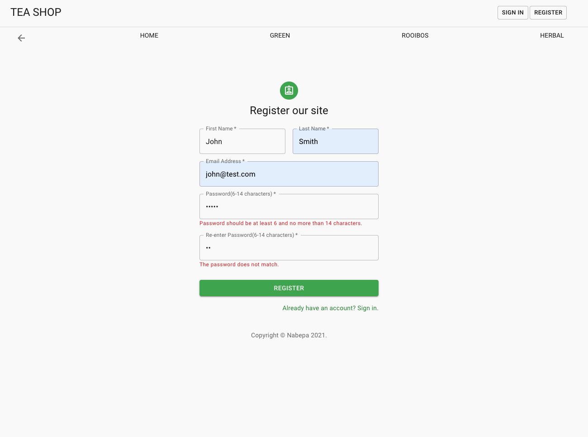
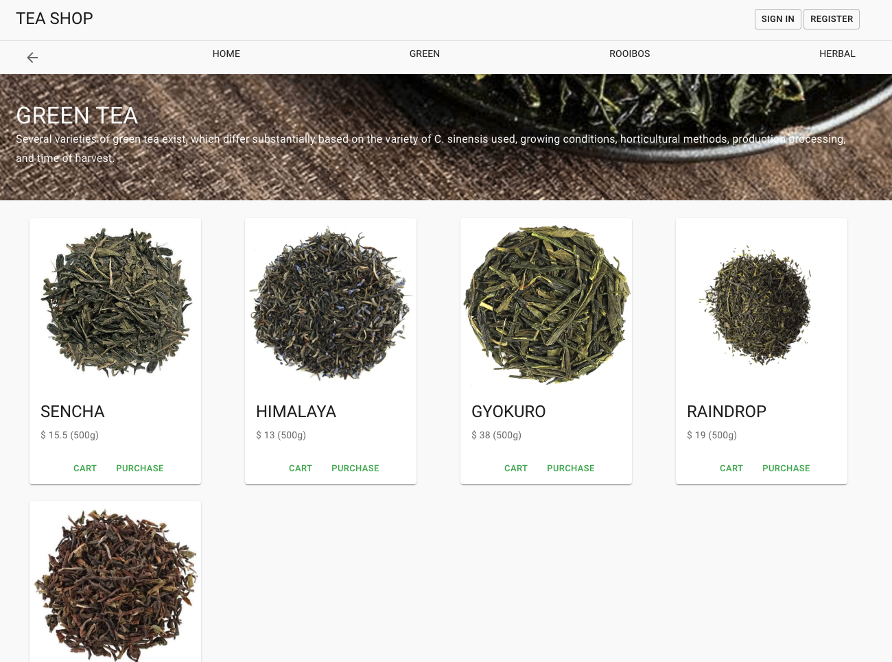

# Teashop

Read this in other languages: [日本語 🇯🇵](README.md)

You can try this app, click below badge!
 

## 🚀 개요

- 찻잎을 판매하는 사이트를 상정하고, 프론트 사이드와 서버 사이드를 구현
- 테스트용 아이디
  - 관리자 ID: tim@test.com PW: 123456
  - 일반 유저 ID: john@test.com PW: 123456

## ⭐️ 기능

### 구현 완료 🙆🏻‍♀️

- 회원 등록과 로그인

  

- 상품 등록(관리자 전용)

  

- 카테고리별 상품 열람

  

- 상품 상세 정보 열람

  

### 개발중 🙅🏻

- 등록 상품의 수정 및 제거
- 카트 추가
- 구입
- 상품 검색

## 🦄 사용언어와 프레임워크

### Client side

    &nbsp;&nbsp;
    &nbsp;&nbsp;
    &nbsp;&nbsp;
 

### Server side

    &nbsp;&nbsp;
    &nbsp;&nbsp;

## 📚 사용 라이브러리와 툴

### Client side

- [axios]() : 데이터 fetch용
- [react-router-dom]() : page routing
- [react-hook-form]() : form 제출 데이터의 유효성 검사
- [Netlify]() : Client side 배포

### Server side

- [bcrypt]() : 패스워드 암호화
- [jsonwebtoken]() : 유저 인증을 위한 Token
- [sequelize]() : Postgres를 위한 ORM
- [dotenv]() : configuration 설정
- [postman]() : 서버 동작 확인용
- [Heroku]() : Server side 배포

### 기타

- [Cloudinary]() : 사진 보존을 위한 cloud service

## 📖 Project에서 새롭게 공부한 것

## 🐛 Debug 기록
