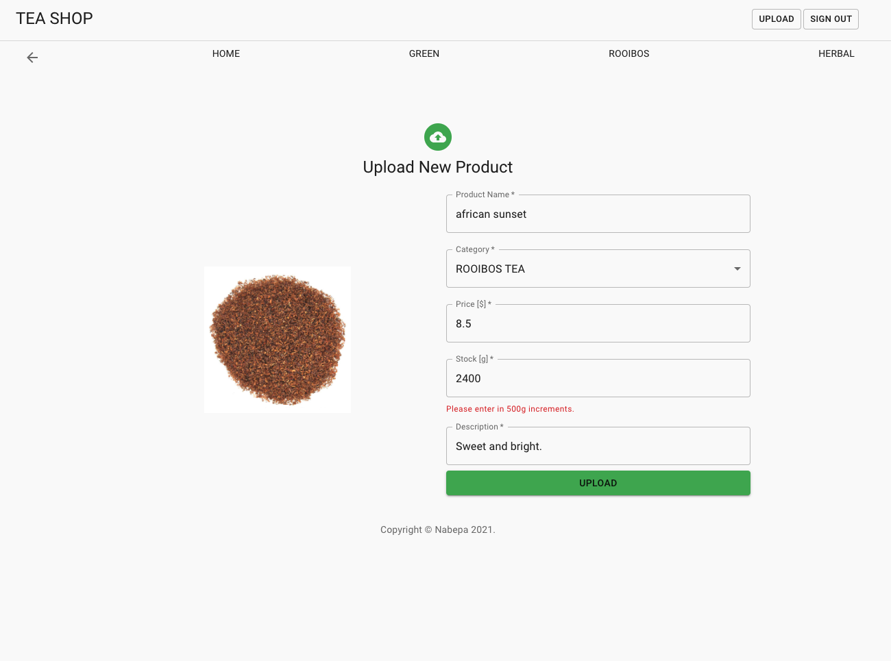
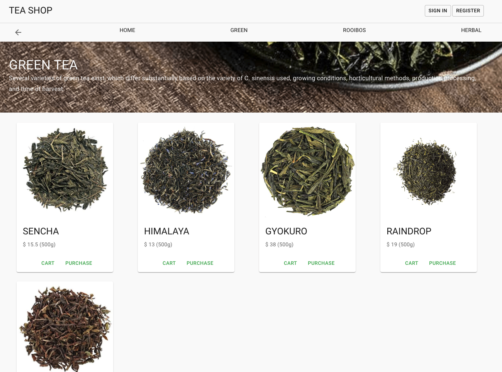
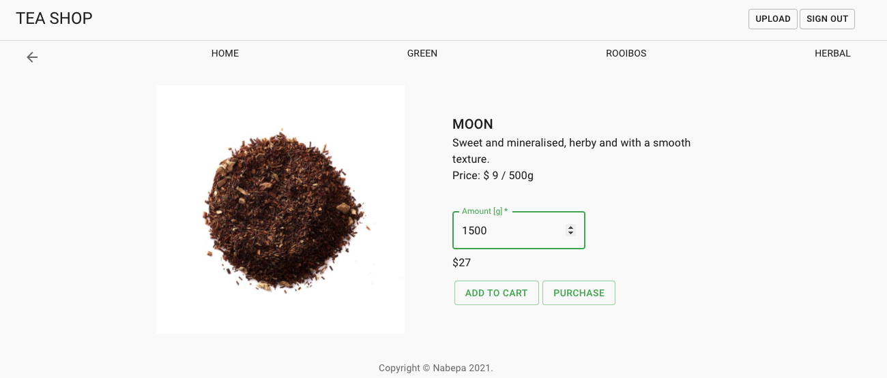

# Teashop

Read this in other languages: [한국어 🇰🇷](README.ko.md)

You can try this app, click below badge!
 

## 🚀 概要

- 茶っ葉を販売するサイトを想定し，フロント側とバックエンド側を実装
- テスト用アカウント
  - 管理者ユーザー ID: tim@test.com PW: 123456
  - 一般ユーザー ID: john@test.com PW: 123456

## ⭐️ 機能

### 実装済み 🙆🏻‍♀️

- 会員登録とログイン

  

- 商品登録(管理者アカウントのみ)

  

- カテゴリ別商品閲覧

  

- 商品詳細情報閲覧

  

### 開発中 🙅🏻

- 登録商品の修正・削除
- カートに追加
- 購入
- 商品検索

## 🦄 使用言語とフレームワーク

### Client side

    &nbsp;&nbsp;
    &nbsp;&nbsp;
    &nbsp;&nbsp;
 

### Server side

    &nbsp;&nbsp;
    &nbsp;&nbsp;

## 📚 使用ライブラリとツール

### Client side

- [axios]() : データ fetch 用
- [react-router-dom]() : page routing
- [react-hook-form]() : form 提出データの有効性検査
- [Netlify]() : Client side 配布

### Server side

- [bcrypt]() : パスワード暗号化
- [jsonwebtoken]() : ユーザー認証のための Token
- [sequelize]() : Postgres のための ORM
- [dotenv]() : configuration 設定
- [postman]() : サーバー動作確認用
- [Heroku]() : Server side 配布

### その他

- [Cloudinary]() : 写真保存用の cloud service

## 📖 Project で新しく勉強した事

## 🐛 Debug 記録
